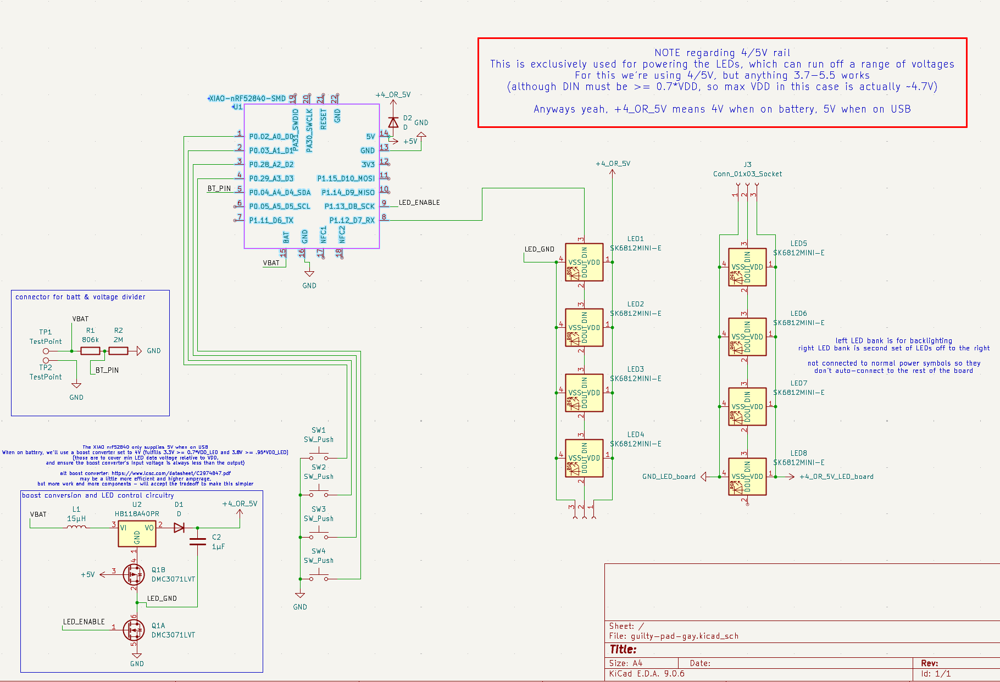
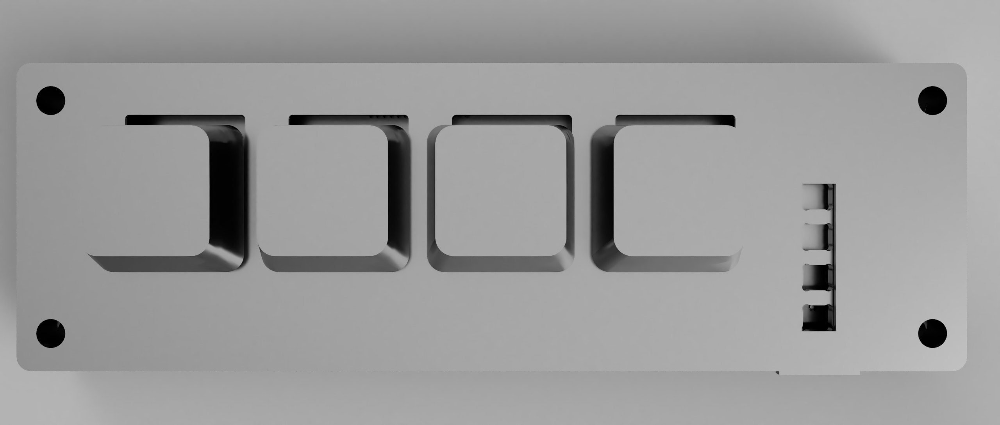

# GUILTY PAD -GAY-

Look this was gonna be normal but then the woke left made me add yuri

---

This is a macro pad which is designed to work with an upcoming keyboard - they will be able to communicate via Bluetooth, or if you've got the right firmware, even act as a very weird split keyboard.

To prevent there just being an awkward blank section in the middle, the side LEDs have been split into a separate board, which will be connected to the main board via some wiring. By adding headers, and with a small case redesign, you could connect them even more easily (and... hotswappably?) - this will likely be added at some point.

## Bill of materials

- [0402 806k resistor](https://www.lcsc.com/product-detail/C3016043.html)
- [0402 2M resistor](https://www.lcsc.com/product-detail/C49653113.html)
- [0603 capacitor](https://www.lcsc.com/product-detail/C1691.html)
- [Mill-Max hotswap sockets](https://keeb.io/products/mill-max-hotswap-sockets?variant=32377167511646) (optional, if you want the switches to be hotswappable)
- [8x SK6803MINI-E](https://www.aliexpress.us/item/3256807898532204.html)
  - Kicad shows SK6812MINI-E because I couldn't find any schematics for the 6803s and didn't want to make my own symbol, but either works. **See [notes](#notes) for important details.**
  - [LED power draw](https://lectronz.com/products/rgb-led-sk68xx-mini-e)
- 4x any MX switches
- [403090 lipo](https://www.aliexpress.us/item/3256809116041100.html) (anything 4mm thick or less is fine - 403090 = 4.0x30x90mm)
- [JST 1.25mm 2-pin cabling](https://www.amazon.com/dp/B07FP2FCYC)
  - Use these to connect the battery rather than just soldering it on. These are not on the PCB directly because that would be far too tall
- [Complimentary P/N channel MOSFETs](https://www.lcsc.com/product-detail/C460972.html)
- [Inductor](https://www.lcsc.com/product-detail/C206361.html)
- [Boost converter](https://www.lcsc.com/product-detail/C410998.html)
- [Diodes](https://www.lcsc.com/product-detail/C402218.html)

Some of these components for the boost conversion circuitry are overkill, this is so that parts can be shared between this and the yet-to-be-made full-size keyboard. If you wanna save just a bit of money, and are only building this, you can cheap out on parts a little.

## Art

- [bridget](https://danbooru.donmai.us/posts/10037913)
- [mayburi](https://danbooru.donmai.us/posts/10155469)
- [testament](https://x.com/kujikawaii/status/1534858361476358144)
- [elphelt](https://static.wikia.nocookie.net/guilty-gear/images/4/44/Elphelt_Guilty_Gear_Strive.png/revision/latest?cb=20240501125741) (from the elphelt fandom page)
- [other mayburi](https://danbooru.donmai.us/posts/9990984)

## Notes

- You can swap out the SK6803s for SK6812s, just keep in mind your battery life will be affected significantly, and SK6803s have better color at low brightness.
  - Additionally, you'd be very close to the max current for the linked battery cabling. It's recommended you get [<=24 AWG cabling](https://www.amazon.com/dp/B0B5D5N332) if you're using SK6812s.
- If you don't want backlighting to be available when on battery, this will significantly simplify the design and reduce the number of tiny SMD components you'd need to solder. You also of course wouldn't have to worry about SK6812s overloading the boost converter.

## Helpful links

- [mouse bites](https://www.studiopieters.nl/mouse-bite/)
- [how to find inductance for a boost converter](https://www.ti.com/lit/an/slva372d/slva372d.pdf)
