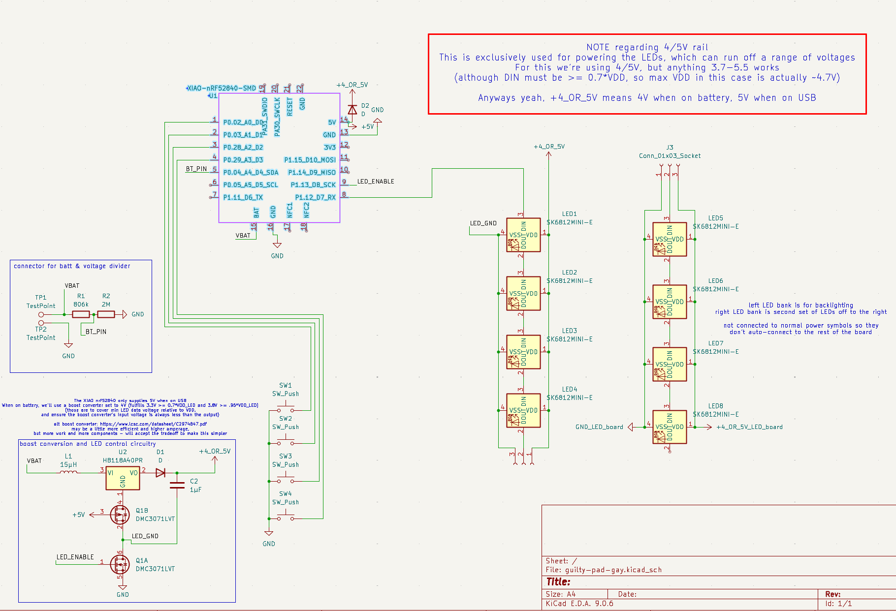
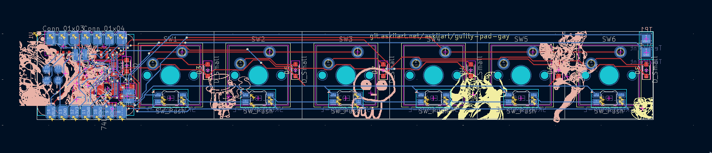
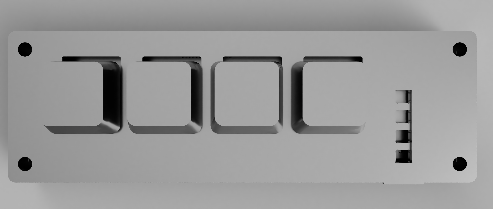

# GUILTY PAD -GAY-

Look this was gonna be normal but then the woke left made me add yuri

---

This is a macro pad which is designed to work with an upcoming keyboard - they will be able to communicate via Bluetooth, or if you've got the right firmware, even act as a very weird split keyboard.

To prevent there just being an awkward blank section in the middle, the side LEDs have been split into a separate board, which will be connected to the main board via some wiring. By adding headers, and with a small case redesign, you could connect them even more easily (and... hotswappably?) - this will likely be added at some point.

## Bill of materials

- [0805 ±0.1% 806k resistor](https://www.lcsc.com/product-detail/C865663.html)
- [0805 ±0.1% 2M resistor](https://www.lcsc.com/product-detail/C2984387.html)
- [0805 22uF capacitor](https://www.lcsc.com/product-detail/C577040.html)
- [CPG151101S11-16 Hotswap sockets](https://www.lcsc.com/product-detail/C41430893.html)
- [6x SK6803MINI-E](https://www.aliexpress.us/item/3256807898532204.html)
  - Kicad shows SK6812MINI-E because I didn't feel like making a new symbol for no reason.
  - [LED power draw](https://lectronz.com/products/rgb-led-sk68xx-mini-e)
- 6x MX switches
- [903090 lipo](https://www.aliexpress.us/item/3256809116041100.html) (anything 9mm thick or less is fine - 903090 = 9.0x30x90mm)
- [1210 4.7uH >=1.2A Isat inductor](https://www.lcsc.com/product-detail/C17701271.html)
- [Boost converter](https://www.lcsc.com/product-detail/C2071163.html)
- [Diodes](https://www.lcsc.com/product-detail/C402218.html)
- [Level shifter](https://www.lcsc.com/product-detail/C42460230.html)
- [AO3400A](https://www.lcsc.com/product-detail/C49195711.html)

Some of these components for the boost conversion circuitry are overkill, this is so that parts can be shared between this and the yet-to-be-made full-size keyboard. If you wanna save just a bit of money, and are only building this, you can cheap out on parts a little.

## Art

- [bridget](https://danbooru.donmai.us/posts/10037913)
- [mayburi](https://danbooru.donmai.us/posts/10155469)
- [testament](https://x.com/kujikawaii/status/1534858361476358144)
- [elphelt](https://static.wikia.nocookie.net/guilty-gear/images/4/44/Elphelt_Guilty_Gear_Strive.png/revision/latest?cb=20240501125741) (from the elphelt fandom page)
- [other mayburi](https://danbooru.donmai.us/posts/9990984)

## Notes

- You can swap out the SK6803s for SK6812s, just keep in mind to account for them obviously being much brighter, and SK6803s have better color at low brightness.
